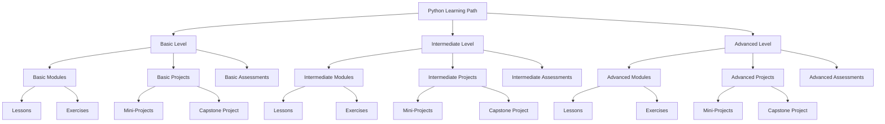

# Design Document: Python Learning Path

## Overview

This design document outlines the architecture and implementation details for a comprehensive Python learning path that follows the "experience -> repeat -> learning" methodology. The learning path is structured into three main levels (Basic, Intermediate, and Advanced) with a focus on practical, hands-on learning through real-world projects. The system is designed to provide a progressive learning experience that builds upon previous knowledge while reinforcing concepts through strategic repetition.

## Architecture

The Python Learning Path will be organized as a hierarchical structure of modules, lessons, exercises, and projects. The architecture follows these principles:

1. **Modularity**: Content is organized into self-contained modules that can be completed independently while building upon previous modules.

2. **Progressive Complexity**: Each level increases in complexity, with concepts building upon previously learned material.

3. **Practical Application**: Every theoretical concept is paired with practical exercises and real-world projects.

4. **Reinforcement Through Repetition**: Key concepts appear multiple times in different contexts to reinforce learning.

5. **Adaptable Learning Paths**: While there is a recommended progression, the architecture allows for some flexibility in the order of completion.

### High-Level Architecture



## Components and Interfaces

### 1. Module Structure

Each module will follow a consistent structure:

```
module_name/
├── README.md           # Module overview, learning objectives, prerequisites
├── lessons/            # Theoretical content and explanations
│   ├── lesson1.md
│   ├── lesson2.md
│   └── ...
├── exercises/          # Hands-on practice exercises
│   ├── exercise1.py
│   ├── exercise2.py
│   └── ...
├── solutions/          # Reference solutions for exercises
│   ├── solution1.py
│   ├── solution2.py
│   └── ...
└── mini_project/       # Module culmination project
    ├── README.md       # Project requirements and instructions
    ├── starter_code/   # Scaffolding code if needed
    └── solution/       # Reference implementation
```

### 2. Level Structure

Each level (Basic, Intermediate, Advanced) will be organized as follows:

```
level_name/
├── README.md           # Level overview, learning path, prerequisites
├── module1/           
├── module2/           
├── ...
└── capstone_project/   # Level culmination project
    ├── README.md       # Project requirements and instructions
    ├── starter_code/   # Scaffolding code if needed
    └── solution/       # Reference implementation
```

### 3. Exercise Interface

Exercises will follow a consistent format:

- Clear instructions at the top of the file
- TODO comments indicating where code should be written
- Test cases to verify the solution
- Expected output or behavior description

Example:
```python
"""
Exercise: Function to calculate the factorial of a number

Instructions:
1. Implement the factorial function below
2. The function should return the factorial of the input number
3. Handle edge cases (negative numbers, zero)
4. Run the tests to verify your solution
"""

def factorial(n):
    # TODO: Implement the factorial function
    pass

# Tests
def test_factorial():
    assert factorial(0) == 1
    assert factorial(1) == 1
    assert factorial(5) == 120
    try:
        factorial(-1)
        print("Test failed: Should raise ValueError for negative numbers")
    except ValueError:
        print("Test passed: Correctly raised ValueError for negative numbers")

if __name__ == "__main__":
    test_factorial()
    print("All tests completed")
```

### 4. Project Interface

Projects will include:

- README.md with:
  - Project overview and objectives
  - Requirements specification
  - Setup instructions
  - Implementation guidelines
  - Testing procedures
  - Extension challenges
- Starter code (when appropriate)
- Test suite for validation
- Reference solution (in a separate directory)

## Data Models

### 1. Module Model

```python
class Module:
    """Represents a learning module in the Python Learning Path."""
    
    def __init__(self, name, description, prerequisites=None, learning_objectives=None):
        self.name = name
        self.description = description
        self.prerequisites = prerequisites or []
        self.learning_objectives = learning_objectives or []
        self.lessons = []
        self.exercises = []
        self.mini_project = None
```

### 2. Lesson Model

```python
class Lesson:
    """Represents a theoretical lesson within a module."""
    
    def __init__(self, title, content, concepts=None):
        self.title = title
        self.content = content
        self.concepts = concepts or []  # Key concepts covered
```

### 3. Exercise Model

```python
class Exercise:
    """Represents a practical exercise within a module."""
    
    def __init__(self, title, instructions, starter_code=None, solution=None, test_cases=None):
        self.title = title
        self.instructions = instructions
        self.starter_code = starter_code
        self.solution = solution
        self.test_cases = test_cases or []
```

### 4. Project Model

```python
class Project:
    """Represents a project (mini or capstone) within the learning path."""
    
    def __init__(self, title, description, requirements=None, starter_code=None, solution=None):
        self.title = title
        self.description = description
        self.requirements = requirements or []
        self.starter_code = starter_code
        self.solution = solution
        self.extension_challenges = []
```

## Content Organization

### Basic Level

1. **Python Fundamentals**
   - Python installation and setup
   - Variables and data types
   - Basic operators
   - Input/output operations
   - Control flow (if/else, loops)
   - Functions and scope
   - Mini-project: Command-line calculator

2. **Data Structures**
   - Lists and list comprehensions
   - Tuples
   - Dictionaries
   - Sets
   - String manipulation
   - Mini-project: Text analyzer

3. **File Operations**
   - Reading and writing files
   - Working with CSV files
   - Error handling (try/except)
   - Mini-project: CSV data processor

4. **Basic Level Capstone Project**
   - Command-line task manager application

### Intermediate Level

1. **Object-Oriented Programming**
   - Classes and objects
   - Inheritance and polymorphism
   - Encapsulation and abstraction
   - Magic methods
   - Mini-project: Library management system

2. **Functional Programming**
   - Lambda functions
   - Map, filter, reduce
   - Decorators
   - Generators and iterators
   - Mini-project: Data processing pipeline

3. **Modules and Packages**
   - Creating modules
   - Package structure
   - Virtual environments
   - Dependency management (pip)
   - Mini-project: Custom utility package

4. **Testing and Debugging**
   - Unit testing with pytest
   - Debugging techniques
   - Logging
   - Code quality tools
   - Mini-project: Test-driven development exercise

5. **Intermediate Level Capstone Project**
   - Weather data analysis application

### Advanced Level

1. **Advanced Data Structures and Algorithms**
   - Algorithm complexity
   - Recursion
   - Searching and sorting
   - Trees and graphs
   - Mini-project: Algorithm implementation challenge

2. **Concurrency and Parallelism**
   - Threading
   - Multiprocessing
   - Asyncio
   - Concurrent execution patterns
   - Mini-project: Web scraper with concurrency

3. **Web Development**
   - HTTP basics
   - Flask framework
   - RESTful APIs
   - Database integration
   - Mini-project: RESTful API service

4. **Data Science Fundamentals**
   - NumPy
   - Pandas
   - Data visualization
   - Basic statistical analysis
   - Mini-project: Data analysis dashboard

5. **Advanced Level Capstone Project**
   - Full-stack web application with data analysis features

## Error Handling

The learning path will implement comprehensive error handling to provide helpful feedback to learners:

1. **Exercise Validation**
   - Clear error messages for common mistakes
   - Hints system for struggling learners
   - Progressive hint system (starts vague, becomes more specific)

2. **Project Testing**
   - Comprehensive test suites for projects
   - Detailed feedback on test failures
   - Edge case handling

3. **Learning Path Navigation**
   - Prerequisites checking
   - Recommendations for review if struggling
   - Alternative explanations for difficult concepts

## Testing Strategy

### 1. Exercise Testing

Each exercise will include:
- Unit tests for functionality verification
- Edge case tests
- Performance tests where relevant

### 2. Project Testing

Projects will include:
- Functional tests
- Integration tests
- User acceptance criteria tests
- Performance benchmarks where relevant

### 3. Learning Path Testing

The overall learning path will be tested for:
- Logical progression of concepts
- Concept coverage completeness
- Appropriate difficulty scaling
- Time estimates for completion

## Implementation Considerations

### 1. File Organization

The learning path will be organized in a Git repository with the following structure:

```
python-learning-path/
├── README.md                 # Overview and getting started
├── basic/                    # Basic level content
│   ├── README.md             # Level overview
│   ├── 01_python_fundamentals/
│   ├── 02_data_structures/
│   ├── 03_file_operations/
│   └── capstone_project/
├── intermediate/             # Intermediate level content
│   ├── README.md             # Level overview
│   ├── 01_object_oriented_programming/
│   ├── 02_functional_programming/
│   ├── 03_modules_and_packages/
│   ├── 04_testing_and_debugging/
│   └── capstone_project/
├── advanced/                 # Advanced level content
│   ├── README.md             # Level overview
│   ├── 01_advanced_data_structures/
│   ├── 02_concurrency_parallelism/
│   ├── 03_web_development/
│   ├── 04_data_science_fundamentals/
│   └── capstone_project/
└── resources/                # Shared resources
    ├── setup_guides/
    ├── cheat_sheets/
    └── recommended_readings/
```

### 2. Documentation Standards

All content will follow these documentation standards:

- Clear, concise language
- Consistent formatting using Markdown
- Code examples with proper syntax highlighting
- Diagrams where appropriate (using Mermaid or similar)
- Links to additional resources

### 3. Code Style

All Python code will follow:
- PEP 8 style guidelines
- Comprehensive docstrings
- Type hints where appropriate
- Consistent naming conventions

## Extension Points

The learning path is designed with several extension points for future expansion:

1. **Additional Levels**
   - Expert level for specialized topics
   - Domain-specific tracks (e.g., web development, data science, DevOps)

2. **Interactive Elements**
   - Integration with coding platforms
   - Automated feedback systems
   - Progress tracking

3. **Community Features**
   - Discussion forums
   - Peer code review
   - Collaborative projects

4. **Content Formats**
   - Video tutorials
   - Interactive notebooks
   - Quizzes and assessments

## Conclusion

This design document outlines a comprehensive Python learning path that follows the "experience -> repeat -> learning" methodology. The modular architecture allows for progressive skill development while ensuring concepts are reinforced through practical application and strategic repetition. The clear organization of content into basic, intermediate, and advanced levels provides a structured learning experience that can be adapted to different learning styles and goals.